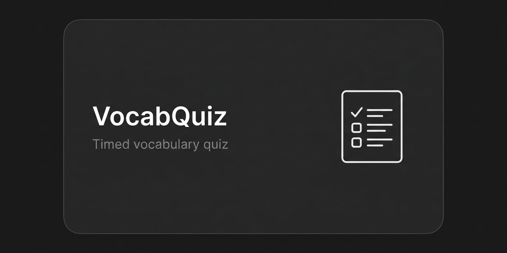

# VocabQuiz

[](LICENSE)
[](https://papermc.io/downloads/paper)
[](https://www.spigotmc.org/resources/vault.34315/)

A broadcast vocabulary quiz for English-learning servers. Every 10 minutes
the server announces a theme (animals, food, weather, colors and more),
each player gets a personal question, and the first correct answer within
30 seconds pays out.

<p align="center">
  
</p>

Part of a four-plugin ESL family: [Chat2Earn](https://github.com/itsfedor/chat2earn) · [EnglishProgression](https://github.com/itsfedor/englishprogression) · [VocabQuiz](https://github.com/itsfedor/vocabquiz) · [DailyEnglish](https://github.com/itsfedor/dailyenglish)

## Why this plugin exists

Passive vocabulary is useless in chat. A quiz that interrupts the game
every few minutes makes players recall words on a timer, which is closer to
real conversation than reading a word list.

## Features

- Quiz every 10 minutes, 30 seconds to answer, 60 second player cooldown
- 8 themes that cycle daily: animals, food, weather, colors, clothes, body, family, school
- Questions filtered by the player's English level (LuckPerms track `english`), so A0 players get A0 words
- $5.00 reward per correct answer (configurable)

## Requirements

- Paper or Spigot 1.21+
- [Vault](https://www.spigotmc.org/resources/vault.34315/) + an economy plugin (e.g. [EssentialsX](https://essentialsx.net/downloads.html))
- Optional: [LuckPerms](https://luckperms.net/) — level filtering (`levels.enabled`) is **on by default** and needs the `english` track; without LuckPerms set `levels.enabled: false`.

## Commands

```
/answer <word>         answer the current question
/vocabquiz join        join the current quiz
/vocabquiz skip        skip this round
/vocabquiz theme       show the current theme
/vocabquiz reload      reload config
```

## Install

1. Download `VocabQuiz.jar` from [Releases](https://github.com/itsfedor/vocabquiz/releases/latest) (or use the copy in the repo root).
2. Put the jar in `plugins/`.
3. Copy `config.example.yml` to `config.yml`.
4. Restart the server.

If you keep `levels.enabled: true` (default), first create the LuckPerms
track `english` — or set `levels.enabled: false` to quiz everyone with the
full word pool.

## Build from source

```bash
./gradlew build
```

Requires JDK 21. Produces `build/libs/VocabQuiz.jar`.

## Configuration

```yaml
quiz:
  interval-minutes: 10
  answer-timeout-seconds: 30
  cooldown-seconds: 60

rewards:
  correct-answer: 5.0

themes:
  mode: daily-cycle
  list: [animals, food, weather, colors, clothes, body, family, school]

levels:
  enabled: true
  track: english
  default: a0
```

## Troubleshooting

- **No questions are asked** — check the quiz interval in `config.yml` and the console: a plugin-level error (Vault missing) disables the whole loop.
- **Wrong level's words (or empty rounds)** — with LuckPerms, players are placed by the `english` track; create it (`/lp createtrack english`) or set `levels.enabled: false`.
- **Rewards not paid** — a Vault-registered economy plugin must be present; Vault by itself pays nothing.

## License

MIT. See [LICENSE](LICENSE).
